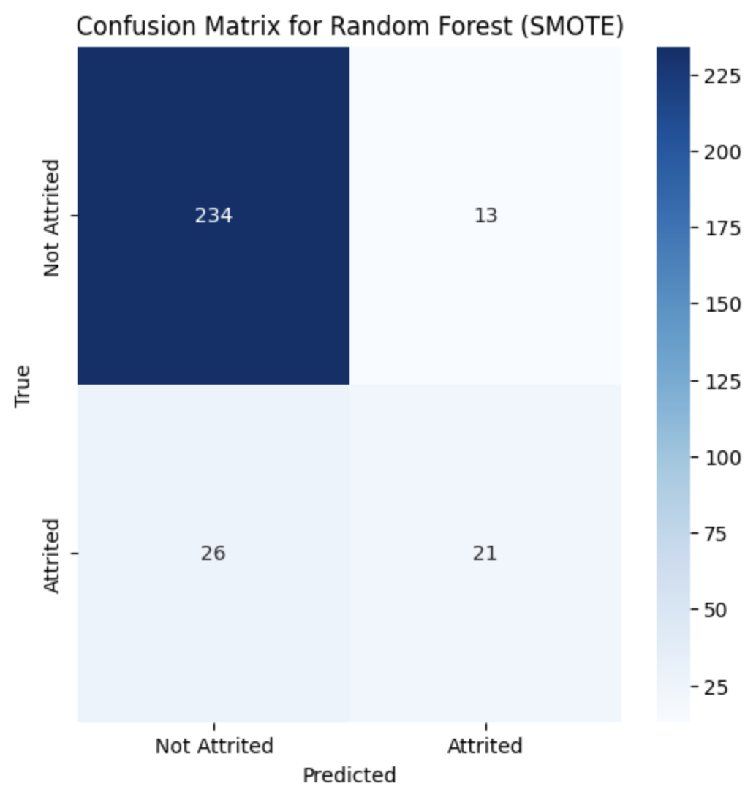
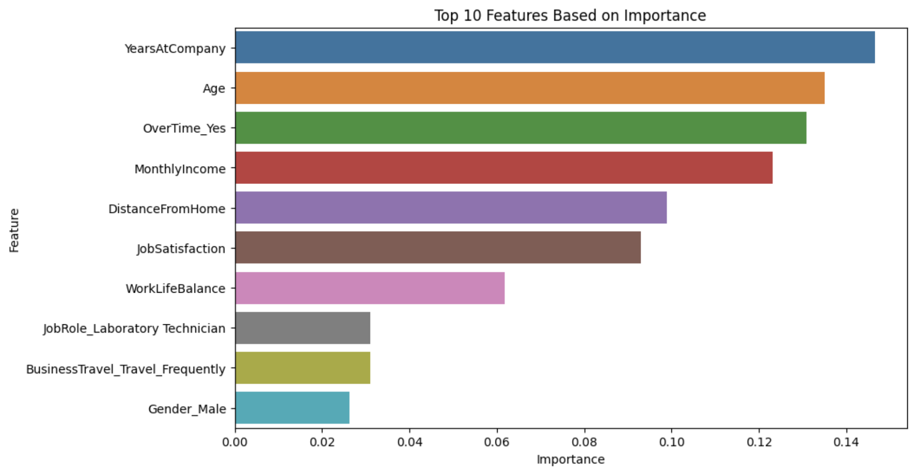
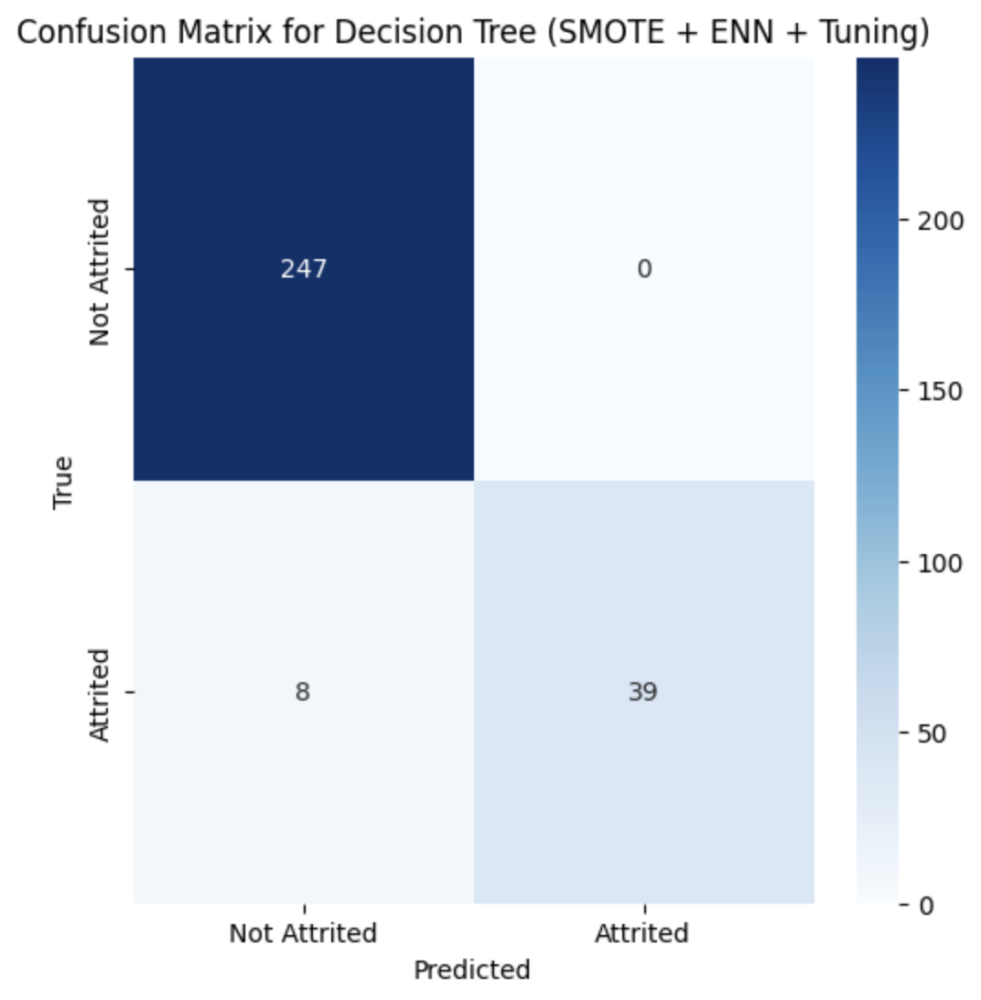
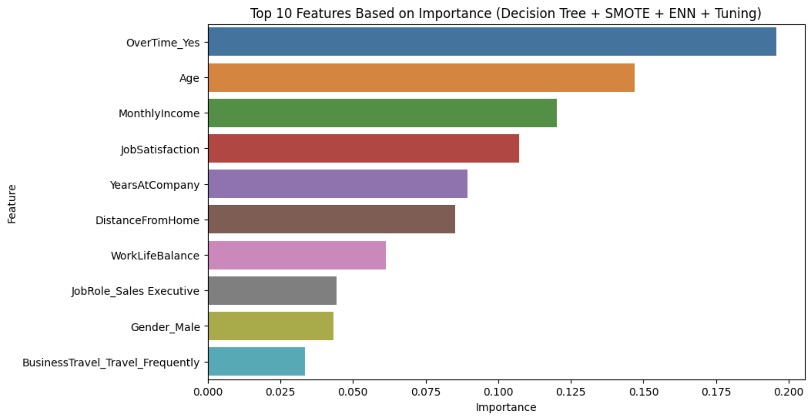
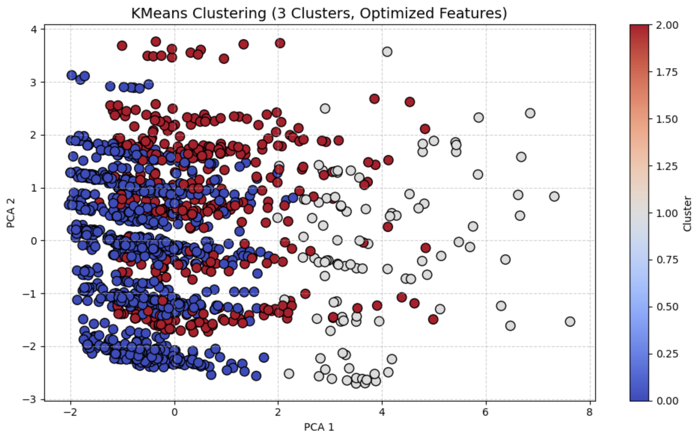
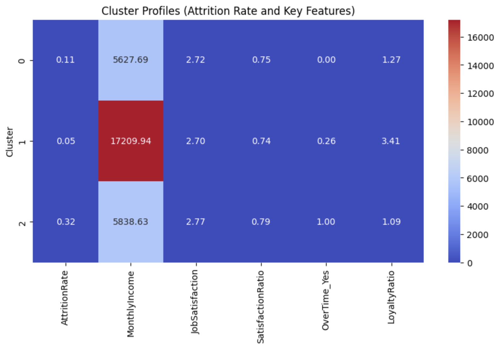

# Employee Attrition Prediction Using Machine Learning

This project develops a machine learning solution for predicting employee attrition using the IBM HR Analytics dataset. It applies classification and clustering techniques to uncover attrition patterns, assess risk factors, and support strategic HR planning.

---

## 📈 Project Summary

Attrition poses a significant risk to organizational performance due to talent loss, hiring costs, and reduced morale. This project uses machine learning to:

- Predict which employees are most at risk of leaving
- Identify key predictors of attrition
- Segment employees using clustering for strategic intervention

---

## 🛠️ Methodology Overview

| Stage                 | Details |
|----------------------|---------|
| **Preprocessing**    | One-hot encoding, Z-score normalization, feature selection |
| **Balancing**        | SMOTE + ENN to handle class imbalance |
| **Models**           | Decision Tree (with tuning), Random Forest, KMeans clustering |
| **Feature Engineering** | LoyaltyRatio, StressIncome, SatisfactionRatio |
| **Evaluation**       | Accuracy, Recall, Confusion Matrix, Feature Importance, Cluster Profile

---

## 🔍 Key Results

| Model            | Accuracy | Recall (Attrited) | Notes |
|------------------|----------|--------------------|-------|
| Decision Tree    | 97.28%   | 0.83               | Best performance, interpretable |
| Random Forest    | 86.73%   | 0.45               | Strong baseline, good precision |
| KMeans Clustering| 80.76%   | -                  | Validated cluster-aligned grouping |

---

## 📊 Visual Outputs

### Decision Tree (SMOTE + ENN + Tuning)

**Confusion Matrix**  


**Top Features**  


---

### Random Forest (SMOTE)

**Confusion Matrix**  


**Top Features**  


---

### KMeans Clustering

**PCA Cluster Projection**  


**Cluster Profile Heatmap**  


---

## 📁 Repository Structure

employee-attrition-prediction/
├── employee-attrition-prediction.ipynb # Main notebook
├── Project Report.pdf # Full project documentation
├── images/ # Visual output for README
│ ├── confusion_matrix_dt.png
│ ├── feature_importance_dt.png
│ ├── confusion_matrix_rf.png
│ ├── feature_importance_rf.png
│ ├── kmeans_pca.png
│ ├── kmeans_cluster_profile.png
├── requirements.txt # Dependencies
└── README.md # This file

---

## 📂 Dataset

- **Source**: [IBM HR Analytics Attrition & Performance - Kaggle](https://www.kaggle.com/datasets/pavansubhasht/ibm-hr-analytics-attrition-dataset)
- **Size**: 1,470 employees, 35 features
- **Target**: `Attrition` (binary classification)

---

## 👨‍💻 Author Contribution

> Developed as part of CP3403 – Data Mining (James Cook University)

**Sai Ohm Saie Paine**  
- Developed the Random Forest pipeline with class rebalancing
- Led feature engineering and exploratory data analysis
- Co-created clustering strategy and PCA interpretation
- Wrote results and visual analytics for final report

---

## 📦 Setup

Install required packages:

```bash
pip install -r requirements.txt

---

## 📬 Contact

📧 Email: your.email@example.com  
🔗 LinkedIn: [linkedin.com/in/sai-ohm-saie-paine-43687b283](https://www.linkedin.com/in/sai-ohm-saie-paine-43687b283)
